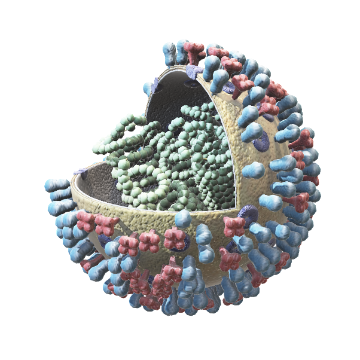
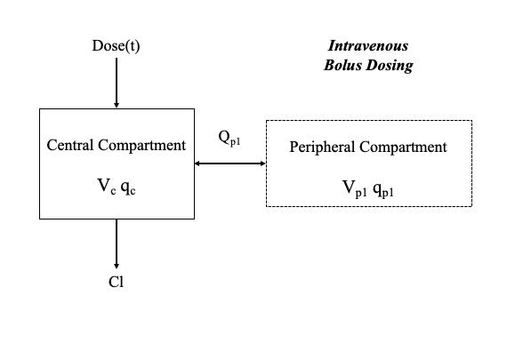
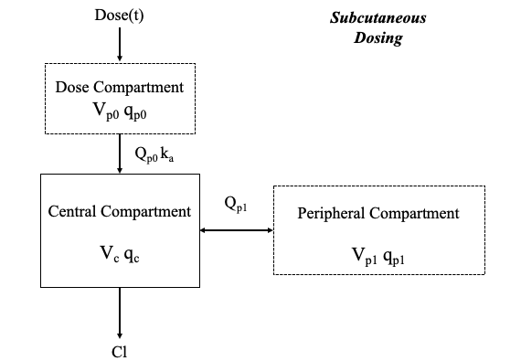

<!-- Prpject Title and Logo -->
<br />
<p align="center">
    
  </a>

  <h3 align="center">PK Toolbox</h3>

  <p align="center">
    A Pharmokinetic Model and Visualisation Toolbox!
    <br />
    <a href="https://pk-toolbox.readthedocs.io"><strong>Explore the docs »</strong></a>
    <br />
    <br />
    <a href="https://github.com/oj-tooth/PK-Toolbox">View Demo</a>
    ·
    <a href="https://github.com/oj-tooth/PK-Toolbox/issues">Report Issue</a>
    ·
  </p>
</p>

<!-- Table of Contents -->
## Table of Contents

* [About the PK Toolbox](#about-the-pk-toolbox)
  * [Background](#background)
* [Getting Started](#getting-started)
  * [Prerequisites](#prerequisites)
  * [Installation](#installation)
* [Usage](#usage)
  * [Example](#example)
* [License](#license)
* [Contact](#contact)
* [Acknowledgements](#acknowledgements)

<!-- About the PK Toolbox -->
## About The PK Toolbox

**T**he PK Toolbox is a Python library dedicated to the simulation and visualisation of Pharmokinetic (PK) models. 

Users are able to:

* model the body as one or more compartments
* utilise either *intravenous bolus* or *subcutaneous* dosing protocols
* specify the dose and duration of dosing
* compare multiple PK model ouputs

### Background

PK models are used to describe how a specific chemical (drug) is absorbed, distributed and excreted in the body. Modelling ensures that a drug achieves the required efficacy while minimising adverse events by sustaining a concentration within a defined therapeutic window. 

Multi-compartmental PK models, in which the body is divided into one or more interacting compartments, are the most commonly used. Below we present the structure of the two PK models available in the PK Toolbox: 

<p align="center">
     
     
 </a>
<p

**Parameter List**

For *intravenous bolus* dosing protocol:
* Dose(t) - Dose function (ng hr<sup>-1</sup>) 
* V<sub>c</sub> - Volume of central compartment (mL)
* q<sub>c</sub> - Concentration of drug in central compartment (ng)
* V<sub>pn</sub> - Volume of peripheral compartment n (mL)
* q<sub>n</sub> - Concentration of drug in peripheral compartment n (ng)
* Q<sub>pn</sub> - Transition between central compartment and peripheral compartment n (mL hr<sup>-1</sup>)
* CL - Clearance rate from the central compartment (mL hr<sup>-1</sup>) 

Additional paramers for *subcutaneous* dosing protocol:
* V<sub>q0</sub> - Volume of dosage compartment (mL)
* q<sub>0</sub> - Concentration of drug in dosage compartment (ng)
* Q<sub>p0</sub> - Transition between dosage compartment and central compartment (mL hr<sup>-1</sup>)
* k<sub>a</sub> - Absorption rate to central compartment (hr<sup>-1</sup>)

<!-- Getting Started -->
## Getting Started

This is an example of how you may give instructions on setting up your project locally.
To get a local copy up and running follow these simple example steps.

### Prerequisites

List prerequiste software.
* software name
```sh
installation code
```

### Installation

1. Instruction
2. Instruction with code snippet
```sh
installation code
```
3. Instruction


<!-- Usage -->
## Usage

Introduce the user workflow and main files in this section. Include graphics.

## Example

Provide complete use case example.
<!-- _For more examples, please refer to the [Documentation](URL)_ -->


<!-- License -->
## License

Distributed under the MIT License. Add link to license file when complete.


<!-- Contact -->
## Contact

Update collaborators. 
<!-- Your Name - [@your_twitter](https://twitter.com/your_username) - email@example.com -->

Project Link: [https://github.com/oj-tooth/PK-Toolbox](https://github.com/oj-tooth/PK-Toolbox)


<!-- Acknowledgements -->
## Acknowledgements

Include bullet point list.
Adapted from available template: 
https://github.com/othneildrew/Best-README-Template/blob/master/README.md
