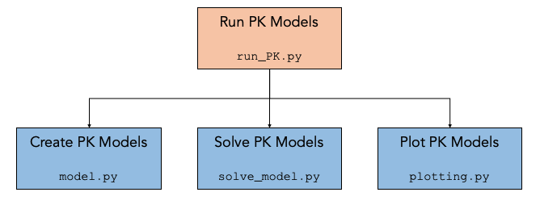

<!-- Prpject Title and Logo -->


 


<br />
<p align="center">
    
  </a>

  <h3 align="center">PK Toolbox</h3>

  <p align="center">
    A Pharmokinetic Model and Visualisation Toolbox!
    <br />
    <a href="https://pk-toolbox.readthedocs.io"><strong>Explore the docs »</strong></a>
    <br />
    <br />
    <a href=https://github.com/oj-tooth/PK-Toolbox/#example>View Demo</a>
    ·
    <a href="https://github.com/oj-tooth/PK-Toolbox/issues">Report Issue</a>
    ·
  </p>
</p>

<!-- Table of Contents -->
## Table of Contents

* [About the PK Toolbox](#about-the-pk-toolbox)
  * [Background](#background)
* [Getting Started](#getting-started)
  * [Prerequisites](#prerequisites)
  * [Installation](#installation)
* [Usage](#usage)
  * [Example](#example)
* [License](#license)
* [Contact](#contact)
* [Acknowledgements](#acknowledgements)

<!-- About the PK Toolbox -->
## About The PK Toolbox

The PK Toolbox is a Python library dedicated to the simulation and visualisation of Pharmokinetic (PK) models. 

Users are able to write their own scripts or utilise the PK Toolbox user interface to:

* model the body with peripheral compartments
* utilise either *intravenous bolus* or *subcutaneous* dosing protocols
* specify the dose and duration of dosing
* compare multiple PK model ouputs

### Background

PK models are used to describe how a specific chemical (drug) is absorbed, distributed and excreted in the body. Modelling ensures that a drug achieves the required efficacy while minimising adverse events by sustaining a concentration within a defined therapeutic window. 

Multi-compartmental PK models, in which the body is divided into one or more interacting compartments, are the most commonly used. Below we present the structure of the two PK models available in the PK Toolbox: 

<p align="center">
     
     
 </a>
<p

**Parameter List**

For *intravenous bolus* dosing protocol:
* Dose(t) - Dose function (ng hr<sup>-1</sup>) 
* V<sub>c</sub> - Volume of central compartment (mL)
* q<sub>c</sub> - Concentration of drug in central compartment (ng)
* V<sub>pn</sub> - Volume of peripheral compartment 1 (mL)
* q<sub>n</sub> - Concentration of drug in peripheral compartment 1 (ng)
* Q<sub>pn</sub> - Transition between central compartment and peripheral compartment 1 (mL hr<sup>-1</sup>)
* CL - Clearance rate from the central compartment (mL hr<sup>-1</sup>) 

Additional paramers for *subcutaneous* dosing protocol:
* q<sub>0</sub> - Concentration of drug in dosage compartment (ng)
* k<sub>a</sub> - Absorption rate to central compartment (hr<sup>-1</sup>)

<!-- Getting Started -->
## Getting Started

Below are our simple installation intructions to quickly get started with the PK Toolbox locally.

### Installation

1. To benefit from the PK Toolbox's graphical user interface, we recommend cloning this GitHub repo in either a new or existing directory.
```sh
git clone https://github.com/oj-tooth/PK-Toolbox.git
```
2. Next, lets setup a virtual environment in the cloned PK-Toolbox directory and pip install the PK Toolbox's dependencies (Python packages listed in the requirements.txt file). 
```sh
cd PK-Toolbox

python3 -m venv venv

pip install -r requirements.txt
```
3. Great, finally we can pip install the PK Toolbox from TestPyPI, where it is called pk-toolbox-room8 (room8 is the name of our collaboration!).
```sh 
pip install -i https://test.pypi.org/simple/ pk-toolbox-room8
```

<!-- Usage -->
## Usage

The PK Toolbox is structured as follows:

<p align="center">
     
 </a>
<p

* Users run the either the run_PK.py or run_GUI.py file.
    * When using running the run_GUI.py file, the PK Toolbox Console window is opened, allowing users to specify one or more PK models for configuration.
    * Alternatively, users can run their own PK models manually using the example run_PK.py file.

* The run_PK.py and run_GUI.py files call modules:
    1. model.py : Creates model class objects for each of the user defined PK models.
    2. solve_model.py : Solves models defined by model.py using scipy.integrate.solv_imp.
    3. plotting.py : Creates plot comparing model solutions from solve_model.py. 
    
For further details on each of the modules included in the PK Toolbox view our [docs](https://pk-toolbox.readthedocs.io).

## Example

Below we provide a simple example of how to use the PK Toolbox Console to configuire, run and visualise two PK models:
1. Example_IVB is a single peripheral compartment (2 total compartments) PK model with an *intravenous bolus* dosing protocol and default parameters. 
2. Example_SC is a single peripheral compartment (2 total compartments) PK model with a *subcutaneous* dosing protocol and default parameters.

* **Step 1:** 
  * Run the run_GUI.py file to open the PK Toolbox console window. Below we show how to do this from the command line.
  
```sh 
python3 run_GUI.py
```
  
* **Step 2:** 
  * Configuire Example_IVB with dosing protocol IVB and the default parameters specified in [boxes]. 
  * Press Add Model and a confirmation statement: "Configuired Model: Example_IVB" will print above.
    
<p align="center">
     
 </a>
<p>
    
**Note:** Click on images to view in better quality.
    
* **Step 3:** 
   * Configuire Example_SC with dosing protocol SC and the default parameters specified in [boxes]. 
   * Press Add Model and a confirmation statement: "Configuired Model: Example_SC" will print above.
    
<p align="center">
     
<p>

* **Step 4:** 
    * Now we have finished adding our PK models lets press Run Models to run our simulations. 
    * A line plot containing the drug concentrations output from both of our models will appear in a new figure window.
    
<p align="center">
     
<p

Congratulations, you have ran your first PK models with the PK Toolbox!

<!-- License -->
## License

Distributed under the MIT License. See LICENSE file for further details. 

<!-- Acknowledgements -->
## Acknowledgements

* Adapted README.md from opensource template: 
https://github.com/othneildrew/Best-README-Template/blob/master/README.md
